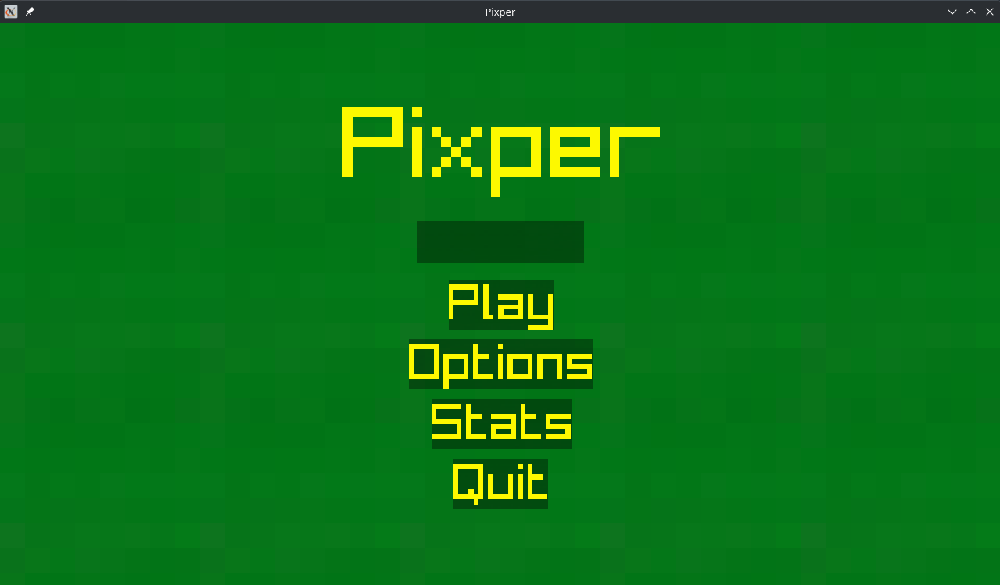
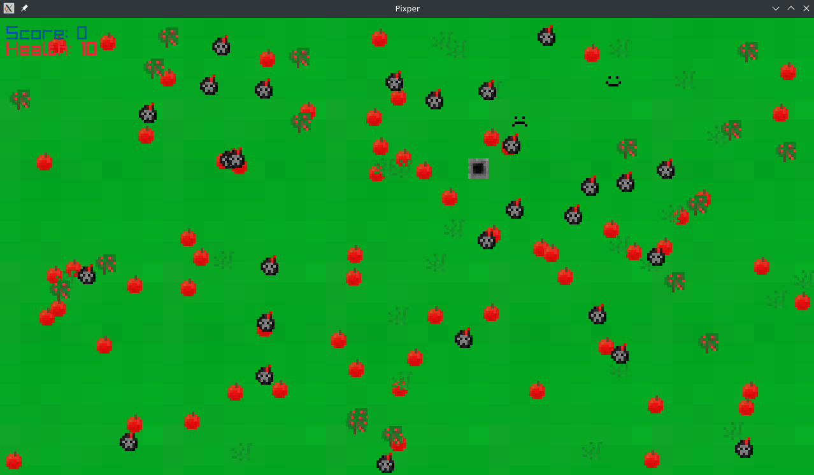
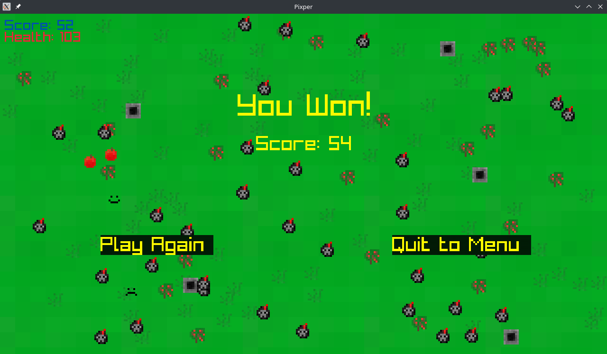
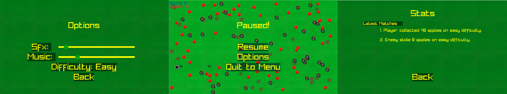

# Introduction to Pixper

**Pixper** is a 2D graphical game in which the objective is to collect all apples generated on a board resembling flatlands, while avoiding dangerous obstacles and entities.

The game is controlled entirely via WASD, although you can also use keys such as Q to quit, P for pausing or Escape for going back. The project was made in C using `raylib` and `sqlite3`.

# Screenshots

The game's initial menu

The gameplay

The end of the game

Other menus (which took me quite a bit of time to code)

# How do I play?

The game is only available for Windows and Linux. A port for Android is planned.

# Instructions for Windows

* Download: https://andrewstephen.xyz/pixper.exe
* Run `pixper.exe` (in case Windows complains about the program being malicious, run anyway, the reason for such an error is that I have not purchased a certificate to verify this program with Microsoft - in case that sounds spooky to you - read the _Building on Windows_ instructions - you can "compile" a build of your own)
* **Enjoy!**

# Building on Windows

* Install git: https://gitforwindows.org/
* Open Powershell or Windows Terminal, NOT cmd
<!-- * **Enjoy!** -->
* TODO

# Instructions for Linux

* Compile/install raylib from the official documentation: https://github.com/raysan5/raylib/wiki/Working-on-GNU-Linux
* Open your favorite terminal emulator
* `sudo apt install libsqlite3-dev` (Debian/Ubuntu - for other distros look up _distroname_ install pip)
* `git clone https://github.com/andrewstephengames/pixper-raylib`
* `cd pixper-raylib`
* `./build-linux`
* **Enjoy!**

# Building on Linux

* Compile/install raylib from the official documentation: https://github.com/raysan5/raylib/wiki/Working-on-GNU-Linux
* Open your favorite terminal emulator
* `sudo apt install libsqlite3-dev` (Debian/Ubuntu - for other distros look up _distroname_ install pip)
* `git clone https://github.com/andrewstephengames/pixper-raylib`
* `cd pixper-raylib`
* `./build-linux`
* **Enjoy!**

